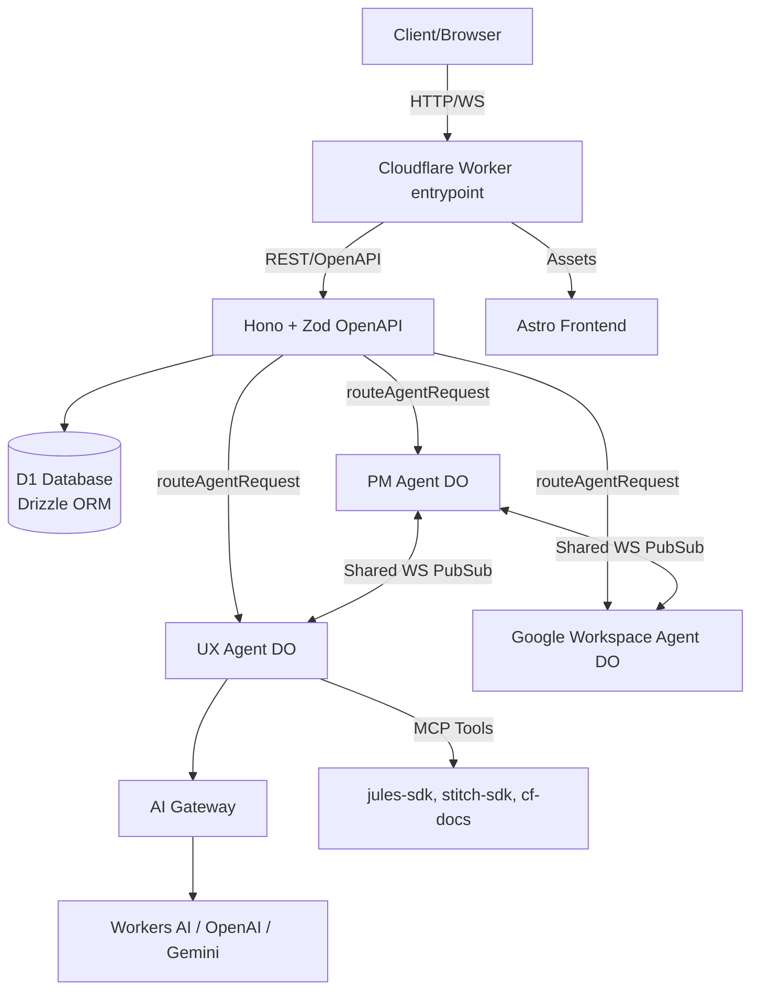
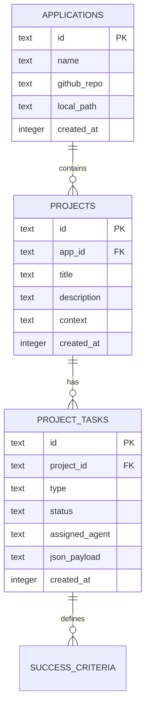

# MindHive — Product Requirements Document

## 1. Executive Summary
MindHive is an edge-native, autonomous software development agency built on Cloudflare Workers. It acts as a developer superpower, leveraging the Cloudflare Agents SDK (backed by SQLite Durable Objects) to wrap specialized agent logic (inspired by Google ADK) into persistent, stateful actors. The system features a Product Manager agent that scopes work, creates application and project records in a D1 database, and orchestrates a shared WebSocket environment where highly specialized teams (UX, Python, AppsScript, Google Workspace, and Cloudflare Ops) collaborate in real-time. The entire system exposes its capabilities via REST, WebSocket, and the Model Context Protocol (MCP), wrapped in a default dark-theme Astro/shadcn frontend.

## 2. Target Users & Use Cases
- **Solo Developers/Founders**: Offload scoping, UX mockup generation, and boilerplate writing to a swarm of agents.
- **Automated CI/CD Pipelines**: Trigger the Cloudflare Ops agent to retrofit UI components or generate OpenAPI specs dynamically via MCP.
- **Project Managers**: Interactively plan applications, allowing the PM Agent to translate ideas into granular `project_tasks.json` records in the database, automatically dispatching to the Workspace Team to generate Google Docs/Sheets.

## 3. System Architecture Overview



## 4. Cloudflare Services Used

| Service | Purpose | Binding Name |
|---------|---------|--------------|
| Workers | Main compute, Hono router, API execution | N/A |
| D1 | Relational state (apps, projects, tasks, success criteria) | `DB` |
| Durable Objects | Stateful Agent instances (SQLite-backed) + PubSub | `PM_AGENT`, `UX_AGENT`, `PY_AGENT`, `APP_AGENT`, `GW_AGENT`, `CF_AGENT` |
| AI Gateway | Routing, caching, and observability for LLM calls | `AI` (via gateway URL) |
| Worker Assets | Hosting the Astro/React frontend directly | `ASSETS` |
| Vectorize (Opt) | Email content indexing for RAG (Workspace Team) | `VECTORIZE_INDEX` |
| Secrets Store | Secure storage for API keys (Google OAuth, etc.) | N/A (Secrets Store) |

## 5. Wrangler Configuration Blueprint

```jsonc
{
  "name": "mindhive",
  "main": "index.ts",
  "compatibility_date": "2026-03-17",
  "compatibility_flags": ["nodejs_compat"],
  "assets": {
    "directory": "../frontend/dist",
    "binding": "ASSETS",
    "not_found_handling": "single-page-application"
  },
  "d1_databases": [
    {
      "binding": "DB",
      "database_name": "mindhive-db",
      "database_id": "<ID>",
      "migrations_dir": "./drizzle"
    }
  ],
  "ai": { "binding": "AI" },
  "durable_objects": {
    "bindings": [
      { "name": "PM_AGENT", "class_name": "ProductManagerAgent" },
      { "name": "UX_AGENT", "class_name": "UxTeamAgent" },
      { "name": "PYTHON_AGENT", "class_name": "PythonTeamAgent" },
      { "name": "APPS_AGENT", "class_name": "AppsScriptTeamAgent" },
      { "name": "WORKSPACE_AGENT", "class_name": "WorkspaceTeamAgent" },
      { "name": "CF_AGENT", "class_name": "CloudflareTeamAgent" },
      { "name": "GITHUB_AGENT", "class_name": "GithubTeamAgent" },
      { "name": "SPECIALTY_AGENT", "class_name": "SpecialtyTeamAgent" }
    ]
  },
  "migrations": [
    {
      "tag": "v1",
      "new_sqlite_classes": [
        "ProductManagerAgent",
        "UxTeamAgent",
        "PythonTeamAgent",
        "AppsScriptTeamAgent",
        "WorkspaceTeamAgent",
        "CloudflareTeamAgent",
        "GithubTeamAgent",
        "SpecialtyTeamAgent"
      ]
    }
  ]
}
```

## 6. Database Design
### 6.1 Schema Overview


### 6.2 Table Specifications
- **applications**: `id` (text PK UUID), `name` (text), `github_repo` (text optional), `local_path` (text optional), `createdAt` (integer timestamp).
- **projects**: `id` (text PK), `app_id` (text FK cascade), `title` (text), `description` (text), `context` (text).
- **project_tasks**: `id` (text PK), `project_id` (text FK), `type` (text 'epic' | 'story' | 'task'), `status` (text), `assigned_agent` (text), `json_payload` (text JSON for full task state).
- **logs**: Standard logging table.

### 6.3 Common Queries
- Fetch all active tasks for a specific agent: `SELECT * FROM project_tasks WHERE assigned_agent = 'UX_AGENT' AND status != 'complete';`
- Fetch project state: `SELECT * FROM projects p JOIN project_tasks pt ON p.id = pt.project_id WHERE p.id = ?;`

## 7. API Design
### 7.1 REST API Endpoints (Hono + Zod)
- `GET /api/applications` - List apps
- `POST /api/applications` - PM Agent trigger to create new app
- `GET /api/projects/{id}/tasks` - View realtime task state
- `POST /api/health/scan` - Trigger cross-agent health check
- `GET /api/openapi.json` - Auto-generated spec (Skill: CF Agent can read DB schema and inject dynamic paths into this spec).

### 7.2 WebSocket API
- `GET /ws/hive` - Upgrades to a shared DO where all agents and the human user can communicate in real time. DO broadcasts state changes.

### 7.3 MCP & Swagger
- `GET /swagger` - Standard UI for exploring the API.
- `GET /mcp` - WebSocket endpoint for external clients to connect to `MindHiveMcpServer` and use the swarm as tools.

## 8. AI & Agents
### 8.1 Agent Inventory
- **ProductManagerAgent** (AIChatAgent): Scopes projects, parses natural language into JSON records, writes to D1, dispatches tasks to other DOs via RPC.
- **UxTeamAgent** (Agent): Uses `jules-sdk` and `stitch-sdk` MCP tools. Plans UX, generates mockups, writes Retrofit plans to Shadcn.
- **PythonTeamAgent** (Agent): CLI builders, NotebookLM interactors, Vectorize RAG managers.
- **AppsScriptTeamAgent** (Agent): AppScript specialized coders.
- **WorkspaceTeamAgent** (Agent): Authenticates via Google APIs. Exports JSON plans to Docs/Sheets. Indexes Gmail to Vectorize. Drafts emails.
- **CloudflareTeamAgent** (Agent): CF experts. Retrofits stitch mockups specifically into Astro + dark theme shadcn. Generates dynamic OpenAPI specs from D1 schema.
- **MindHiveMcpServer** (McpAgent): Exposes the entire swarm to external IDEs (Cursor/Windsurf).

### 8.2 Shared Ecosystem
- **.agent/* files**: Prompts will pull shared context (rules, workflows, skills) from a KV namespace or D1 table injected into their system prompts on `onStart()`.

## 9. Frontend UX Design

> **DEFAULT DARK THEME SHADCN. DEFAULT DARK THEME SHADCN. DEFAULT DARK THEME SHADCN.**

### 9.1 Page Inventory
#### 9.1.1 Landing Page (`/`)
- Hero: "MindHive: Your Cloudflare Native Software Agency."
- Cards: PM Dashboard, UX Studio, Workspace Automations, API Explorer.
- Badges: `Astro`, `Workers`, `Durable Objects`, `Agents SDK`.

#### 9.1.2 Documentation Page (`/docs`)
- **DB Schema Tab**: Complete breakdown of `project_tasks.json` structure inside D1.
- **API Endpoints Tab**: Swagger-like list of all endpoints with colored badges.
- **Agents Tab**: Full system prompts for the PM, UX, Python, Workspace, AppsScript, and CF agents. Explains DO RPC pub/sub logic.
- **MCP Tab**: Instructions on connecting Cursor to the MindHive MCP server.

#### 9.1.3 Health Dashboard Page (`/health`)
- `GET /api/health/latest` on load.
- "Run Hive Check" button pings all Agent DOs, the D1 DB, and Google Workspace OAuth status.

#### 9.1.4 Chat Page (`/chat`)
- Uses `assistant-ui` Thread.
- Connects to the `PM_AGENT` to start a project. The PM Agent can `@mention` other agents, streaming their responses into the single thread via DO RPC aggregation.

#### 9.1.5 Project Kanban Board (`/projects/:id`)
- A visual representation of the D1 `project_tasks` table. Shows epics and user stories moving from `not_started` to `complete` in real-time as agents work.

### 9.2 Component Library
```bash
npx shadcn@latest add button card table badge tabs scroll-area skeleton progress toast dialog alert navigation-menu sidebar separator accordion hover-card command input textarea select form
```

### 9.3 Navigation Structure
- Links: Home, Projects, Docs, Health, Chat, `/openapi.json`, `/swagger`.

## 10. Health & Observability
- Logging service writes all agent tool calls (e.g., stitch-sdk usage, Google Docs API calls) to the D1 `logs` table.

## 11. Security
- `GOOGLE_WORKSPACE_CLIENT_ID` and `CLIENT_SECRET` in Secrets Store.
- AI Gateway token in Secrets Store.


# 12. pakage.json scripts
```json
{
  "scripts": {
    "dev": "astro dev",
    "build": "astro build",
    "types": "npx wrangler types",
    "db:generate": "drizzle-kit generate",
    "migrate:local": "pnpm run db:generate && wrangler d1 migrations apply DB --local",
    "migrate:remote": "pnpm run db:generate && wrangler d1 migrations apply DB --remote",
    "deploy": "pnpm run build && pnpm run migrate:remote && npx wrangler deploy",
    "deploy:tail": "rm -f wrangler.txt && pnpm run deploy && wrangler tail --format pretty | tee wrangler.txt"
  }
} 
```

# 13. Modular Schema Definitions (with drizzle-zod)

**`src/backend/db/schemas/applications.ts`**
```typescript
import { sqliteTable, text, integer } from 'drizzle-orm/sqlite-core';
import { createInsertSchema, createSelectSchema } from 'drizzle-zod';

export const applications = sqliteTable('applications', {
  id: text('id').primaryKey().$defaultFn(() => crypto.randomUUID()),
  name: text('name').notNull(),
  githubRepo: text('github_repo'),
  localPath: text('local_path'),
  createdAt: integer('created_at', { mode: 'timestamp' }).notNull().$defaultFn(() => new Date()),
});

// Infer Zod schemas for Hono OpenAPI
export const insertApplicationSchema = createInsertSchema(applications).openapi('CreateApplication');
export const selectApplicationSchema = createSelectSchema(applications).openapi('Application');
```

**`src/backend/db/schemas/projects.ts`**
```typescript
import { sqliteTable, text, integer } from 'drizzle-orm/sqlite-core';
import { createInsertSchema, createSelectSchema } from 'drizzle-zod';
import { applications } from './applications';

export const projects = sqliteTable('projects', {
  id: text('id').primaryKey().$defaultFn(() => crypto.randomUUID()),
  appId: text('app_id').notNull().references(() => applications.id, { onDelete: 'cascade' }),
  title: text('title').notNull(),
  description: text('description'),
  context: text('context'),
  createdAt: integer('created_at', { mode: 'timestamp' }).notNull().$defaultFn(() => new Date()),
});

export const insertProjectSchema = createInsertSchema(projects).openapi('CreateProject');
export const selectProjectSchema = createSelectSchema(projects).openapi('Project');
```

**`src/backend/db/schemas/project_tasks.ts`**
```typescript
import { sqliteTable, text, integer } from 'drizzle-orm/sqlite-core';
import { createInsertSchema, createSelectSchema } from 'drizzle-zod';
import { projects } from './projects';

export const projectTasks = sqliteTable('project_tasks', {
  id: text('id').primaryKey().$defaultFn(() => crypto.randomUUID()),
  projectId: text('project_id').notNull().references(() => projects.id, { onDelete: 'cascade' }),
  type: text('type').notNull().$type<'epic' | 'story' | 'task'>(),
  status: text('status').notNull().default('not_started'),
  assignedAgent: text('assigned_agent'),
  jsonPayload: text('json_payload', { mode: 'json' }), // Stores the nested steps/criteria
  createdAt: integer('created_at', { mode: 'timestamp' }).notNull().$defaultFn(() => new Date()),
});

export const insertTaskSchema = createInsertSchema(projectTasks).openapi('CreateTask');
export const selectTaskSchema = createSelectSchema(projectTasks).openapi('Task');
```


# 14. Modular API Architecture (REST, WebSocket, MCP)

**Agent Instruction:** The API must be strictly divided by protocol and domain. Use Hono's `OpenAPIHono` for REST, and standard Hono routes with WebSocket upgrade headers for the real-time/MCP integrations.

#### Directory Structure
```text
src/backend/api/
├── rest/
│   ├── applications.ts     # CRUD for apps (uses drizzle-zod schemas)
│   ├── projects.ts         # CRUD for projects
│   └── tasks.ts            # CRUD for tasks
├── ws/
│   └── hive.ts             # Upgrades connection to the shared PubSub DO
└── mcp/
    └── server.ts           # Upgrades connection to the MindHiveMcpServer DO
```

#### REST Example (`src/backend/api/rest/applications.ts`)
```typescript
import { OpenAPIHono, createRoute, z } from '@hono/zod-openapi';
import { createDb } from '@db/index';
import { applications, insertApplicationSchema, selectApplicationSchema } from '@db/schemas/applications';

const route = new OpenAPIHono<{ Bindings: Env }>();

const createApplicationRoute = createRoute({
  method: 'post',
  path: '/',
  tags: ['Applications'],
  summary: 'Create a new application record',
  request: {
    body: {
      content: { 'application/json': { schema: insertApplicationSchema } },
      required: true,
    },
  },
  responses: {
    201: {
      content: { 'application/json': { schema: selectApplicationSchema } },
      description: 'Application created',
    },
  },
});

route.openapi(createApplicationRoute, async (c) => {
  const db = createDb(c.env.DB);
  const data = c.req.valid('json');
  const [newApp] = await db.insert(applications).values(data).returning();
  return c.json(newApp, 201);
});

export { route as applicationsRoute };
```

#### WebSocket/MCP Router Example (`src/backend/index.ts`)
```typescript
import { OpenAPIHono } from '@hono/zod-openapi';
import { swaggerUI } from '@hono/swagger-ui';
import { applicationsRoute } from '@api/rest/applications';
// ... other imports

const app = new OpenAPIHono<{ Bindings: Env }>();

// 1. REST API & Swagger
app.route('/api/applications', applicationsRoute);
app.doc31('/openapi.json', { openapi: '3.1.0', info: { title: 'MindHive API', version: '1.0.0' } });
app.get('/swagger', swaggerUI({ url: '/openapi.json' }));

// 2. WebSocket Hive (Upgrades to PM_AGENT or a dedicated PubSub DO)
app.get('/ws/hive', async (c) => {
  if (c.req.header('Upgrade') !== 'websocket') return c.text('Expected WebSocket', 426);
  const id = c.env.PM_AGENT.idFromName('global-hive');
  const stub = c.env.PM_AGENT.get(id);
  return stub.fetch(c.req.raw);
});

// 3. MCP Server (Upgrades to MCP_SERVER DO)
app.get('/mcp', async (c) => {
  if (c.req.header('Upgrade') !== 'websocket') return c.text('Expected WebSocket', 426);
  const id = c.env.MCP_SERVER.idFromName('global-mcp');
  const stub = c.env.MCP_SERVER.get(id);
  return stub.fetch(c.req.raw);
});

export default app;
```


# 15. TypeScript Configuration & `Env` Strict Rules

#### `tsconfig.json` (Excerpt)
```json
{
  "compilerOptions": {
    "target": "ESNext",
    "module": "ESNext",
    "moduleResolution": "bundler",
    "strict": true,
    "types": [
      "@cloudflare/workers-types",
      "./worker-configuration.d.ts"
    ],
    "baseUrl": ".",
    "paths": {
      "@/*": ["./src/*"],
      "@frontend/*": ["./src/frontend/*"],
      "@backend/*": ["./src/backend/*"],
      "@db/*": ["./src/backend/db/*"],
      "@api/*": ["./src/backend/api/*"],
      "@agents/*": ["./src/backend/ai/agents/*"]
    }
  },
  "include": ["src/**/*.ts", "src/**/*.tsx", "worker-configuration.d.ts"]
}
```


